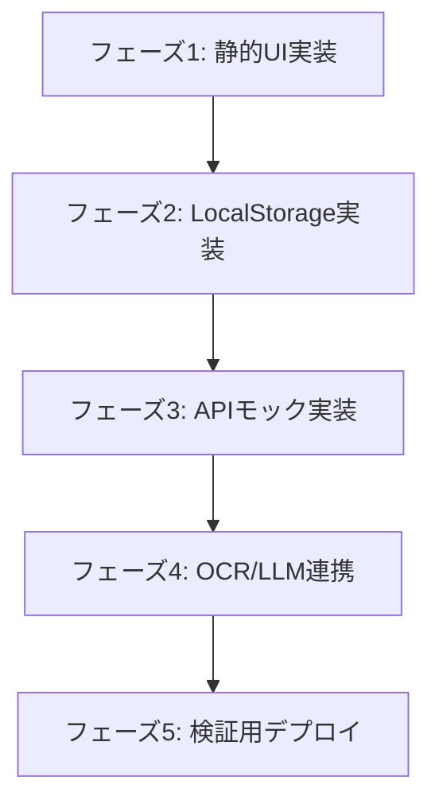

# 実装計画書：School Letter Helper

本書は、「School Letter Helper」MVPの開発を、段階的かつ安全に進めるための実装計画書である。初期開発では外部API連携や複雑なインフラ設定を避け、まずは「モックデータによる4画面プロトタイプがローカルで動作する状態」を目指す。

---

## 1. 実装フェーズと概要

開発は以下の5つのフェーズに分けて進行する。各フェーズが完了するごとに動作確認を行い、品質を担保する。



### 【フェーズ1】静的UIの構築
*   **目的**: モバイルファーストでレスポンシブな4つの主要画面のビジュアルとコンポーネントを作成する。
*   **状態**: API呼び出しやLocalStorageへのアクセスは行わず、モックの静的データを用いて表示のみを行う。

### 【フェーズ2】LocalStorageの実装とデータ連携
*   **目的**: 設定（言語、保存可否、デフォルト名）および解析履歴をブラウザ内に保存・復元できるようにする。
*   **状態**: 画面遷移時にLocalStorageの読み書きが正常に機能する。

### 【フェーズ3】APIモックの実装（ローカル動作完了のゴール）
*   **目的**: `/api/analyze` エンドポイントを仮実装し、画像をアップロードした際のローディングおよび結果表示の流れをシミュレートする。
*   **状態**: どのような画像を送っても、固定のJSON（模擬解析結果）が返り、結果画面へ遷移する。**（初期プロトタイプの完成）**

### 【フェーズ4】OCRおよびLLM外部API連携
*   **目的**: Google Cloud Vision API および OpenAI / Gemini API を接続し、本物の画像解析を行えるようにする。
*   **状態**: アップロードしたプリント画像から、実際にToDoや要約が抽出される。

### 【フェーズ5】検証用デプロイとユーザーテスト
*   **目的**: Vercel または Cloudflare Pages にデプロイし、事前登録者等へのクローズドベータテストを実施する。
*   **状態**: 公開URLでスマートフォンから実機検証が行える。

---

## 2. 作成予定ファイル一覧

Next.js (App Router) 構成において、以下のファイルを新規作成・更新する。

| パス | 種別 | 説明 |
| :--- | :--- | :--- |
| `app/page.tsx` | [NEW] | 画面1：ホーム / プリントアップロード画面 |
| `app/result/page.tsx` | [NEW] | 画面3：ToDo・やさしい日本語・翻訳確認画面 |
| `app/reply/page.tsx` | [NEW] | 画面4：先生宛て返信文生成画面 |
| `app/api/analyze/route.ts` | [NEW] | `/api/analyze` エンドポイント (最初はモック) |
| `lib/localStorage.ts` | [NEW] | LocalStorageへの保存・読み込み・削除ヘルパー |
| `types/analysis.ts` | [NEW] | 解析結果、設定、ToDoの共通型定義ファイル |
| `components/LanguageSelector.tsx` | [NEW] | ヘッダー用多言語切り替え共通コンポーネント |
| `app/layout.tsx` | [MODIFY] | 全体のフォント、共通レイアウト、SEO meta定義の適用 |

---

## 3. 各フェーズの詳細作業項目と実装方針

### 3.1 【フェーズ1】静的UIの構築
*   **ホーム画面 (`app/page.tsx`)**:
    *   Tailwind CSS を用いたモバイルフレンドリーなレイアウト。
    *   ファイル選択インプット（`input[type="file"]`）と、ドラッグ＆ドロップエリアのUIコーディング。
    *   「この端末に履歴を保存しない」チェックボックスの配置。
    *   プライバシーポリシー、一時API送信の注意文をヘッダー/フッター付近に明示。
*   **結果確認画面 (`app/result/page.tsx`)**:
    *   「要約 (Summary)」と「やること (ToDo)」のタブ切り替えUIの実装。
    *   チェックボックス付きのToDoリストUI。
    *   「先生に返信を書く」ボタン、ホームへの導線。
*   **返信文生成画面 (`app/reply/page.tsx`)**:
    *   返信目的（出席、欠席、遅刻、質問）の切り替えUI。
    *   名前（保護者・児童）および自由入力フォームの配置。
    *   生成された日本語文章のテキストプレビューと、「日本語をコピー」ボタン。

### 3.2 【フェーズ2】LocalStorage実装
*   `lib/localStorage.ts` に以下の関数を実装する。
    *   `getAppSettings()` / `saveAppSettings(settings)`
    *   `getHistory()` / `addHistoryEntry(entry)` / `clearAllHistory()`
    *   `updateTodoStatus(entryId, todoId, completed)`
*   **連携処理**:
    *   画面1の初期読み込み時に `saveHistory` の設定値を反映する。
    *   画面3のToDoチェック切り替え時に `updateTodoStatus` を呼び出す。
    *   画面1で「すべての履歴を削除」が押されたら、確認用モーダルを出し、`clearAllHistory()` を実行。

### 3.3 【フェーズ3】APIモック実装
*   `app/api/analyze/route.ts` にて、**外部API接続を行わず**、数秒（例: 1.5秒）の `setTimeout`（遅延）を挟んで固定のJSONレスポンスを返すようにする。
*   **APIモック設計 (Response JSON)**:
    ```json
    {
      "success": true,
      "id": "mock-uuid-9999",
      "analyzedAt": "2026-05-29T16:00:00Z",
      "title": "【モック】遠足のお知らせ",
      "easyJapaneseSummary": [
        "6がつ12にち（きんようび）に えんそくに いきます。",
        "おべんとう、みずとう、ぼうし を もってきてください。",
        "さんかせんしょ（かみ）を 6がつ5にち までに だしてください。"
      ],
      "translatedSummary": [
        "The school trip will take place on June 12th (Friday).",
        "Please bring a lunch box, water bottle, and hat.",
        "Please submit the consent form by June 5th."
      ],
      "todos": [
        { "id": "todo-1", "task": "参加同意書の提出 (Submit consent form)", "deadline": "6月5日", "completed": false },
        { "id": "todo-2", "task": "お弁当・水筒・帽子の準備 (Prepare lunch, water, hat)", "deadline": "6月12日", "completed": false }
      ],
      "replyTemplates": {
        "attendance": "いつもお世話になっております。〇〇の保護者です。遠足の件、参加いたします。よろしくお願いいたします。",
        "absence": "いつもお世話になっております。〇〇の保護者です。遠足の件、当日は欠席とさせていただきます。よろしくお願いいたします。"
      }
    }
    ```
*   **画面2（ローディング）の制御**:
    *   ホーム画面で画像がアップロードされたら、ローディング状態（スピナー、進捗テキスト）へ切り替える。
    *   `fetch('/api/analyze')` を呼び出し、モックレスポンスを受け取ったら画面3へデータを遷移させて表示する。

### 3.4 【フェーズ4】OCR/LLM連携 (外部接続)
*   **Google Cloud Vision API 連携**:
    *   環境変数 `GOOGLE_APPLICATION_CREDENTIALS` または APIキーを構成。
    *   Base64画像をVision APIに送信し、日本語テキストを抽出する。
*   **LLM API (Gemini/OpenAI) 連携**:
    *   APIキーの設定。
    *   プロンプトの記述（日本語おたよりを、構造化JSON、やさしい日本語、多言語翻訳、返信テンプレートに一括変換する指示）。
    *   **機微情報のマスキング**: 送信プロンプトの中で、「もし明確に児童個人名・住所と判別できるものがあれば、[児童名]のようにプレースホルダーに置換して解析せよ」とのインストラクションを付与。

---

## 4. 開発における重要なセキュリティルール（厳守）

1.  **完全サーバーDBレス**:
    *   サーバーサイドのDB（PostgreSQL, MongoDB等）およびストレージ（S3等）への保存ロジックは一切作らない。
2.  **APIログの制御（ログ出力禁止）**:
    *   サーバー側の `console.log` や外部ロギングツールにおいて、**画像Base64、OCR全文、解析後の要約、生成された返信文**を決して出力しない。
    *   APIのログには、「ステータスコード」「処理時間」「成否（boolean）」「画像サイズ」のみを記録する。
3.  **クライアントサイドでのログ保護**:
    *   開発完了時、コンソールへのデバッグ出力（`console.log(analysisResult)` 等）は完全に削除またはプロダクションビルド時に無効化する。

---

## 5. まず作らないもの (非推奨・スコープ外)

MVPの検証速度を落とさないため、初期段階では以下の機能は実装しない。

-   **ユーザーログイン / サインアップ機能** (NextAuth, Firebase Auth等)
-   **サーバー側での履歴永続化**
-   **画像補正・トリミング・歪み補正機能** (クライアントサイドのライブラリ等を用いた編集画面)
-   **PDF自体の直接プレビュー表示** (テキスト抽出のみ対象とする)
-   **多言語以外のAIチャット機能** (返信文調整はフォーム入力のみで行う)
