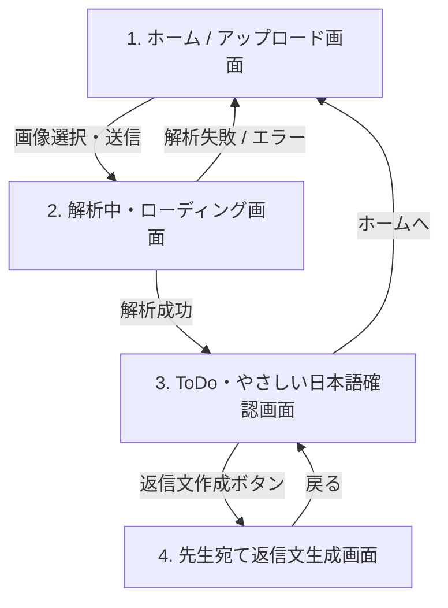

# 画面遷移・UI設計仕様書：School Letter Helper

本書は、「School Letter Helper」MVPにおける各画面のUI構成、操作要素、エラー表示、およびブラウザの `LocalStorage` との連携仕様を定義した設計書である。

---

## 1. 全体画面遷移フロー

MVPは以下の4画面で構成され、ユーザーは迷わず一直線にタスク完了まで進むことができる設計とする。



---

## 2. 画面詳細設計

### 2.1 画面1：ホーム / プリントアップロード画面 (Home / Upload)

*   **目的**: ユーザーがプリント画像をアップロードし、解析を開始する入り口。また、過去の解析履歴へのアクセスを提供する。
*   **UIレイアウト**:
    *   **ヘッダー**: 
        *   ロゴ（School Letter Helper / おたよりヘルパー）
        *   言語切り替えドロップダウン（日本語 / English / Português / Tiếng Việt）
    *   **メインエリア**:
        *   キャッチコピー：「日本の学校プリントを、やることリストに変える。」
        *   **アップロードドラッグ＆ドロップエリア**: 
            *   カメラのアイコン
            *   「プリントを撮影する / 画像を選ぶ」ボタン
            *   対応形式表示（対応フォーマット: JPEG, PNG, PDF / 最大10MB）
    *   **プライバシー・セキュリティ設定エリア**:
        *   「この端末に履歴を保存しない」チェックボックス（オンにすると、今回の解析結果はLocalStorageに保存されません）
        *   セキュリティ免責事項：「※アップロードされた画像はサーバーに保存されません。AI解析のため外部APIへ一時的に送信されます。」
    *   **履歴エリア**（過去のデータがLocalStorageに存在する場合のみ表示）:
        *   「過去の履歴」タイトル
        *   履歴リスト（カード形式：解析日時、抽出された簡易タイトル、ステータス、詳細確認リンク）
        *   「すべての履歴を削除」ボタン（クリック時、確認ダイアログを表示）
*   **操作と挙動**:
    1.  ユーザーが画像を選択、またはカメラで撮影して確定する。
    2.  ファイル形式およびサイズチェック（フロントエンドバリデーション）。
    3.  問題なければ自動的に `POST /api/analyze` を呼び出し、**画面2（解析中・ローディング画面）**へ遷移する。
*   **エラーハンドリング**:
    *   *ファイル形式エラー*: 「JPEG、PNG、またはPDFファイルを選択してください」と赤字で表示。
    *   *ファイルサイズエラー*: 「ファイルサイズが大きすぎます (最大10MB)」と赤字で表示。

---

### 2.2 画面2：解析中・ローディング画面 (Processing / Loading)

*   **目的**: サーバーサイドでのOCRスキャンおよびLLM（AI）による構造化解析を待つ間、ユーザーに安心感を与える。
*   **UIレイアウト**:
    *   **アニメーションエリア**:
        *   スキャンをイメージさせるインジケーター、またはスケルトンスクリーン。
    *   **進捗テキスト（多言語で順次切り替え表示）**:
        *   「プリントを読み取っています... (Reading the print...)」
        *   「やさしい日本語に直しています... (Converting to easy Japanese...)」
        *   「やることリストを作っています... (Creating to-do list...)」
    *   **プライバシーメッセージ**:
        *   「処理中にサーバーへ画像が保存されることはありません。」
*   **操作と挙動**:
    1.  バックエンドAPI（`/api/analyze`）からのレスポンスを待機。
    2.  レスポンスが正常（HTTP 200）であれば、返却されたデータをブラウザに保持し、**画面3（ToDo確認画面）**へ自動遷移。
    3.  「この端末に履歴を保存しない」がオフの場合、結果を `LocalStorage` の履歴に追加。
*   **エラーハンドリング**:
    *   *タイムアウト/APIエラー*: 「解析に失敗しました。画像のピントが合っているか確認し、もう一度お試しください。」というエラー画面を表示。「ホームに戻る」ボタンを設置。

---

### 2.3 画面3：ToDo・やさしい日本語・翻訳確認画面 (Result / Dashboard)

*   **目的**: 解析された内容を確認し、タスク（期日、持ち物、費用）を理解・管理する。
*   **UIレイアウト**:
    *   **タブ切り替えナビゲーション**:
        1.  「要約 (Summary)」タブ
        2.  「やること (ToDo)」タブ
    *   **「要約 (Summary)」タブの内容**:
        *   **やさしい日本語要約**: LLMが生成した3文以内の極めて簡単な日本語箇条書き。
        *   **翻訳テキスト**: ユーザーが選択した母語（英語・ポルトガル語など）による対訳。
        *   **原文テキスト（折りたたみ）**: OCRで抽出された生の日本語テキストを確認できるアコーディオン。
    *   **「やること (ToDo)」タブの内容**:
        *   期日、持ち物、提出物、金額がカード形式でリスト化。
        *   チェックボックス付きのToDoアイテム（チェックを入れると打ち消し線が表示される）。
    *   **フッターアクションエリア**:
        *   「先生に返信を書く」ボタン（画面4へ遷移）
        *   「ホームへ戻る」ボタン
*   **操作と挙動**:
    *   ユーザーがToDoアイテムのチェックボックスを操作すると、リアルタイムで `LocalStorage` 上の該当データの `completed` フラグが更新され、状態が維持される。
*   **LocalStorage連携**:
    *   この画面で表示される情報は、画面1で「保存しない」を選択していない限り、LocalStorage의 `history` 配列に保存されたデータを読み書きする。

---

### 2.4 画面4：先生宛て返信文生成画面 (Reply Generator)

*   **目的**: 日本の学校の商習慣やマナーに沿った、先生向けの連絡文章（日本語）を簡単に作成・コピーできるようにする。
*   **UIレイアウト**:
    *   **返信目的の選択（ラジオボタン/チップ）**:
        *   「出席・参加 (Attending)」
        *   「欠席 (Absence)」
        *   「遅刻・早退 (Late/Early Leave)」
        *   「質問・相談 (Inquiry)」
    *   **基本情報入力フォーム**（初回入力時にLocalStorageに保存され、次回から自動入力）:
        *   「お子様の名前 (Child's Name)」入力欄
        *   「保護者の名前 (Parent's Name)」入力欄
    *   **追加情報入力フォーム**（選択した目的によって動的に変化）:
        *   欠席の場合：「熱が出たため」「法事のため」等の理由入力欄（主要な理由は選択式ボタンも用意）。
    *   **返信プレビューエリア**:
        *   生成された日本語の返信文章（例：「いつもお世話になっております。〇〇の母です。明日、熱があるため欠席いたします。よろしくお願いいたします。」）
        *   文章の意味を理解するための「翻訳対訳（母語）」を表示。
    *   **アクションエリア**:
        *   「日本語をコピーする」ボタン（クリップボードへコピーされ、「コピーしました」と一時トースト通知を表示）
        *   「戻る」ボタン（画面3へ戻る）
*   **操作と挙動**:
    *   フォームの入力内容が変更されるたびに、クライアントサイドで文章がリアルタイムに再合成される。
    *   保護者名、お子様名は入力されると同時に `LocalStorage` の `settings` に保存され、サーバー送信なしに次回以降のフォームに自動反映される。

---

## 3. LocalStorage データ構造 (Data Schema)

ブラウザに保存するデータのJSONスキーマは以下のように定義する。

```json
{
  "settings": {
    "language": "en",
    "saveHistory": true,
    "defaultParentName": "山田 花子",
    "defaultChildName": "山田 太郎"
  },
  "history": [
    {
      "id": "uuid-1234-5678",
      "analyzedAt": "2026-05-29T16:00:00Z",
      "title": "遠足のお知らせ (Field Trip Notice)",
      "easyJapaneseSummary": [
        "6がつ12にち に えんそくへ いきます。",
        "おべんとう と みずとう を もってきてください。",
        "さんかせんしょ を だしてください。"
      ],
      "translatedSummary": [
        "Go on a field trip on June 12.",
        "Please bring a lunch box and a water bottle.",
        "Please submit the consent form."
      ],
      "todos": [
        {
          "id": "todo-1",
          "task": "参加同意書の提出 (Submit consent form)",
          "deadline": "6月5日",
          "completed": false
        },
        {
          "id": "todo-2",
          "task": "お弁当と水筒の準備 (Prepare lunch & water bottle)",
          "deadline": "6月12日",
          "completed": true
        }
      ],
      "replyTemplates": {
        "attendance": "いつもお世話になっております。遠足の件、参加いたします。よろしくお願いいたします。",
        "absence": "いつもお世話になっております。遠足の件、欠席いたします。よろしくお願いいたします。"
      }
    }
  ]
}
```

---

## 4. 共有端末・プライバシー保護のUI挙動

端末を家族や他者と共有している環境（共有タブレットやPCなど）におけるデータ漏洩を防ぐため、以下のUI制御を実装する。

1.  **「保存しない」設定の徹底**:
    *   画面1で「この端末に履歴を保存しない」にチェックが入っている場合、解析完了後の画面3遷移時に `history` 配列への追加処理をスキップする。
    *   画面3からブラウザを閉じる、または「ホームに戻る」ボタンを押した時点で、メモリ上の解析データは破棄され、履歴には一切残らない。
2.  **履歴削除の1クリック実行**:
    *   「すべての履歴を削除」ボタンを押した際、「すべてのデータを削除しますか？この操作は取り消せません。」という明確な多言語アラートを表示し、承認後に `localStorage.removeItem('history')` を実行して即座に画面を更新する。
3.  **注意喚起メッセージの配置**:
    *   履歴エリアのすぐそばに「学校や図書館などの共有端末をお使いの場合は、利用後に履歴を削除するか、『保存しない』設定にチェックを入れてください」という注意書きを常時表示する。
